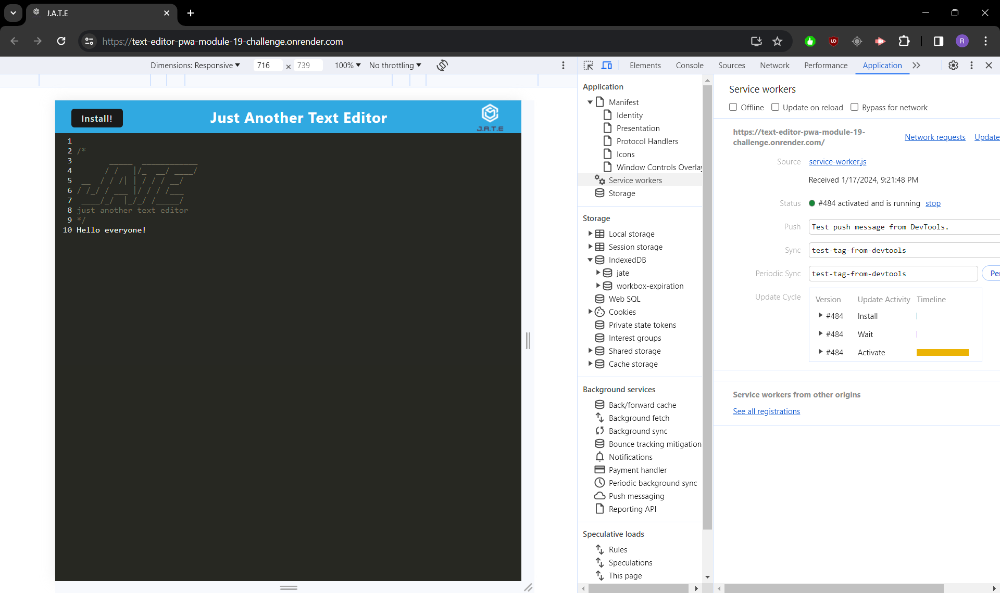

# Text Editor PWA - Module 19 Challenge

## Table of Contents

1. [Description](#description)
2. [Installation](#installation)
3. [Usage](#usage)
4. [Contributors](#contributors)
5. [License](#license)
6. [Questions](#questions)
7. [Link](#link)
8. [Screenshot](#screenshot)

## Description

This app is designed as a notepad that can be used both online and offline and will store the data in a cache to be able to use it in in both circumstances. It was made to be an easy-to-use app that serves the function of quick note taking when you need it in various situations. It would be beneficial to have on mobile devices but it could be a quick access resource on desktop as well. I learned a lot about service workers and webpack through the process of developing this app. I found there were a lot of nuances in the code to make things work as intended and a lot of "moving parts" which required more troubleshooting than previous modules. It was interesting to learn and work through and I welcomed the challenge. It is something worth learning in depth as it has a lot of utility in large applications.

## Installation

To use the deployed app you don't need to install anything, however, if you wish to download the PWA and use it as an app, click the "Install" button and it will download the app directly to the desktop. You can then pin it to your taskbar for easy access.

## Usage

To use this project and test it, you only need to type in the box and click outside the box to save it to the database. The app will save the data whenever you click outside of the text window.

## Contributors

Source code was cloned from https://github.com/coding-boot-camp/cautious-meme  
BCS Learning Assistant was utilized at different points throughout the development of this application.

## License

There is no license for this application

## Questions

If you have any questions or would like to see my work, you can see my GitHub portfolio: [Ryan9698](https://github.com/Ryan9698).

or reach me by email: [rcaltabiano90@gmail.com](mailto:rcaltabiano90@gmail.com).

## Link

[Render](https://text-editor-pwa-module-19-challenge.onrender.com/)

## Screenshot

